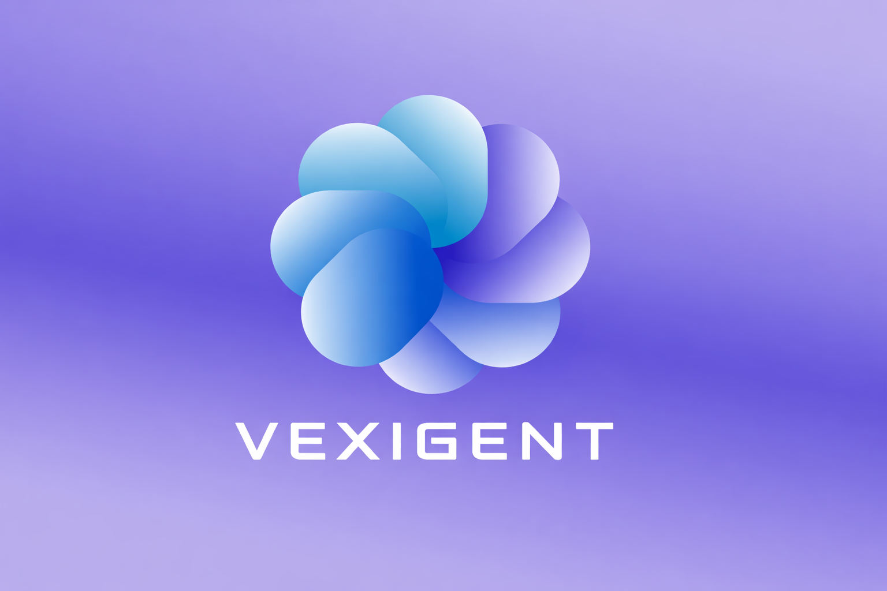

<p align="center">
  
  
  
  
  
  
  
  
  
  
</p>


# Vexigent Platform


> ⚠️ **This project is under active development.** Features are continuously being added and improved. 
> Not all modules are production-ready. Check back regularly for updates.
<p align="center">
  
</p>

**Multimodal AI document-query platform with voice call support.**  
Upload PDFs, images, audio, and video → query them with GPT-4o, Claude, or Gemini → get answers via chat with a live AI phone call support.

Built by **Ahmed Aslam**

---

## Project Structure

```
project/
├── backend/
│   ├── main.py           FastAPI routes (upload, query, auth, session)
│   ├── llm_service.py    LLM wrappers + hybrid RAG query engine
│   ├── rag_service.py    Embeddings, Pinecone vector store, RAG retrieval
│   ├── media_utils.py    Image / audio / video processing (Whisper, GPT-4o vision)
│   └── config.py         Env vars, constants, domain prompts, model catalogue
│
├── voice/
│   └── twilio_server.py  AI phone-support server (Twilio + RAG + GPT-4o)
│
├── frontend/
│   └── app.py            Flask web UI (chat, upload, model selector, call widget)
│
├── .env                  Environment variables (fill this in — never commit)
├── requirements.txt      Python dependencies
└── README.md
```

---

## How It Works

```
User uploads file
      │
      ▼
media_utils.py          Parse image / audio / video / PDF
      │
      ▼
rag_service.py          Chunk → embed (MiniLM) → store in Pinecone
      │
User asks a question
      │
      ▼
rag_service.py          Embed query → similarity search → top-K chunks
      │
      ▼
llm_service.py          Domain system prompt + context + question → LLM
      │
      ▼
Answer returned to frontend (chat) or spoken via Twilio (voice)
```

---

## Prerequisites

- Python 3.10 or later
- A [Pinecone](https://www.pinecone.io) account (free tier works)
- An [OpenAI](https://platform.openai.com) API key (required)
- Optionally: Anthropic, Google AI, and Twilio accounts
- [ngrok](https://ngrok.com) (only needed for the voice server)

---

## Installation

### 1. Clone the repository

```bash
git clone <your-repo-url>
cd project
```

### 2. Create and activate a virtual environment

```bash
python -m venv venv

# macOS / Linux
source venv/bin/activate

# Windows
venv\Scripts\activate
```

### 3. Install dependencies

```bash
pip install -r requirements.txt
```

> **Note — ffmpeg required for audio/video:**  
> Whisper and pydub need ffmpeg installed on your system.  
> macOS: `brew install ffmpeg`  
> Ubuntu: `sudo apt install ffmpeg`  
> Windows: download from https://ffmpeg.org/download.html and add to PATH.

---

## Configuration

Copy `.env` and fill in your credentials:

```bash
cp .env .env.local     # optional: keep a local copy
```

Open `.env` and set at minimum:

```
OPENAI_API_KEY=sk-...
PINECONE_API_KEY=pcsk_...
```

All other keys are optional and unlock additional providers or features.

### Key environment variables

| Variable | Required | Description |
|---|---|---|
| `OPENAI_API_KEY` | ✅ Yes | Powers embeddings, GPT-4o, query rewriting |
| `PINECONE_API_KEY` | ✅ Yes | Vector storage for all uploaded content |
| `ANTHROPIC_API_KEY` | Optional | Enables Claude models in the UI |
| `GOOGLE_API_KEY` | Optional | Enables Gemini models in the UI |
| `TWILIO_ACCOUNT_SID` | Voice only | Twilio account identifier |
| `TWILIO_AUTH_TOKEN` | Voice only | Twilio auth token |
| `TWILIO_PHONE_NUMBER` | Voice only | Your Twilio number in E.164 format |
| `PUBLIC_URL` | Voice only | Your ngrok HTTPS URL |
| `ESCALATION_NUMBER` | Optional | Human fallback number for phone calls |
| `API_URL` | Frontend | Where FastAPI backend is running (default: `http://127.0.0.1:8000`) |
| `SECRET_KEY` | Frontend | Flask session secret — change in production |

---

## Running the Platform

You need to run up to three servers depending on which features you want.

### Step 1 — Start the FastAPI backend

```bash
cd backend
uvicorn main:app --host 127.0.0.1 --port 8000 --reload
```

The API will be available at `http://127.0.0.1:8000`.  
Interactive docs: `http://127.0.0.1:8000/docs`

### Step 2 — Start the Flask frontend

In a new terminal:

```bash
cd frontend
python app.py
```

Open your browser at `http://127.0.0.1:7860`.

### Step 3 (optional) — Start the voice server

In another terminal:

```bash
# Expose port 5000 to the internet via ngrok
ngrok http 5000
```

Copy the `https://...ngrok.io` URL and set it as `PUBLIC_URL` in your `.env`.

Then start the Twilio server:

```bash
cd voice
python twilio_server.py
```

In your [Twilio Console](https://console.twilio.com), set your phone number's voice webhook to:

```
https://your-ngrok-subdomain.ngrok.io/voice-welcome
```

Method: `HTTP POST`

---

## Using the Platform

### Uploading documents

1. Log in or register at `http://127.0.0.1:7860`
2. Click **Upload** in the sidebar
3. Select one or more files — supported types:
   - **PDFs / text** — chunked and indexed as-is
   - **Images** (JPG, PNG, etc.) — described via GPT-4o vision, then indexed
   - **Audio** (MP3, WAV, etc.) — transcribed by Whisper with timestamps, then indexed
   - **Video** (MP4, MOV, etc.) — audio transcribed + frames described every 30 seconds, then indexed
4. Optionally add a **topic tag** to group related files
5. Wait for the status badge to show **Indexed**

### Querying

1. Type your question in the chat box
2. Select a **Provider** (OpenAI / Anthropic / Gemini) and **Model**
3. Select a **Domain** to inject expert context (Legal, Medical, Finance, Code, etc.)
4. Toggle **Agent Mode** to use the LangChain ReAct agent for multi-step reasoning
5. Advanced options:
   - **Reranker** — cross-encoder reranking for better result ordering
   - **Query rewriter** — GPT rewrites your query before retrieval
   - **Top-K** — how many chunks to retrieve (default: 8)

### Content-type aware search

The agent automatically routes queries to the right index:

| Question type | Index searched |
|---|---|
| "What do you see in the image?" | Image index |
| "What was said at 30 seconds?" | Audio index |
| "What happens in the video?" | Video index |
| "Summarize the PDF" | Text/document index |

### Voice call support

1. Click the **Support** button (bottom-right of the UI)
2. Enter your phone number
3. Click **Call Me** — Twilio will call you within seconds
4. Speak naturally — the AI answers all the  questions that you might have regarding the Vexigent AI platform
5. Say "connect me to a human" to trigger escalation (if configured)

---

## API Reference

The FastAPI backend exposes the following endpoints:

| Method | Endpoint | Description |
|---|---|---|
| `POST` | `/upload/` | Upload and index files |
| `GET` | `/upload-status/{upload_id}` | Poll indexing progress |
| `POST` | `/query/` | Hybrid RAG query |
| `POST` | `/query-agent/` | LangChain ReAct agent query |
| `GET` | `/models/` | Available providers, models, domains |
| `POST` | `/auth/register` | Register a new user |
| `POST` | `/auth/login` | Log in |
| `GET` | `/auth/me` | Get current user info |
| `GET` | `/db-files/` | List all indexed files |
| `POST` | `/reset/` | Clear vector store |
| `GET` | `/health/` | Health check |
| `GET` | `/sessions/{id}/logs` | Session query/upload logs |

Full interactive docs at `http://127.0.0.1:8000/docs` when the backend is running.

---

## Pinecone Indexes

The backend automatically creates these four indexes on first use:

| Index name | Content |
|---|---|
| `pdf-query-index` | Text documents and PDFs |
| `pdf-query-index-image` | Image descriptions (GPT-4o vision) |
| `pdf-query-index-audio` | Audio transcripts with timestamps |
| `pdf-query-index-video` | Video transcripts + frame descriptions |

All use 384-dimensional cosine similarity (MiniLM embeddings).

---

## Troubleshooting

**Backend won't start**  
Check that `OPENAI_API_KEY` and `PINECONE_API_KEY` are set in `.env`.

**Audio/video files fail to process**  
Make sure `ffmpeg` is installed and on your PATH (`ffmpeg -version` should work).

**Twilio webhook not receiving calls**  
Confirm your ngrok tunnel is running and `PUBLIC_URL` in `.env` matches the ngrok URL exactly (no trailing slash). Restart the voice server after changing `PUBLIC_URL`.

**"No documents found for this session"**  
Upload files first and wait for the status to show **Indexed** before querying.

**Pinecone index not found error**  
The backend creates indexes automatically, but Pinecone free tier allows only a limited number. Delete unused indexes from your Pinecone console if you hit the limit.

**Model not responding / timeout**  
Increase the timeout in the `requests.post` call in `frontend/app.py`, or check that the provider API key is valid.

---

## Architecture Notes

- **Session isolation** — each user/session gets its own Pinecone namespace prefix so documents never bleed between sessions.
- **Startup hydration** — on restart, the backend re-connects to existing Pinecone indexes so previously uploaded documents remain queryable without re-uploading.
- **Domain prompts** — domain expertise (Legal, Medical, etc.) is injected as a system prompt rather than via a separate fine-tuned model, so the same GPT-4o / Claude / Gemini becomes a domain specialist.
- **Agent vs hybrid** — the `/query/` endpoint uses a direct Prompt+RAG pipeline (fast, predictable); `/query-agent/` runs a full LangChain ReAct loop that can call multiple tools and reason across steps (slower, more thorough).

---
